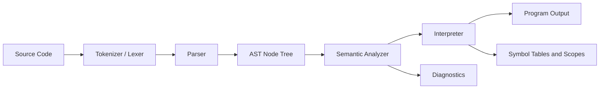

# KaizenLang

<p align="center">
  
</p>

<p align="center">
  <strong>Educational programming language with a full compiler pipeline, semantic analysis, interpreter, and custom Windows IDE.</strong>
</p>

<p align="center">
  
  
  
  
</p>

<p align="center">
  
</p>

---

## Table of Contents

- [Overview](#overview)
- [Project Status](#project-status)
- [Core Features](#core-features)
- [Language Snapshot](#language-snapshot)
- [Architecture](#architecture)
- [Repository Structure](#repository-structure)
- [Tech Stack and Dependencies](#tech-stack-and-dependencies)
- [Requirements](#requirements)
- [Quick Start](#quick-start)
- [How to Run](#how-to-run)
- [IDE Highlights](#ide-highlights)
- [Examples and Test Assets](#examples-and-test-assets)
- [Automated Tests](#automated-tests)
- [Useful Environment Variables](#useful-environment-variables)
- [Known Limitations](#known-limitations)
- [Troubleshooting](#troubleshooting)
- [Documentation and Assets](#documentation-and-assets)
- [Academic Context](#academic-context)

---

## Overview

KaizenLang is an academic language project designed to teach compiler and interpreter fundamentals through a custom syntax and a complete implementation stack.

The project includes:

1. Lexical analysis
2. Syntactic analysis
3. Semantic analysis
4. AST interpretation at runtime
5. A dedicated desktop IDE
6. CLI tools for execution and testing

KaizenLang keeps familiar programming concepts (`if`, `for`, `while`, functions, arrays) while adding identity through custom block delimiters (`ying`, `yang`) and themed type names.

---

## Project Status

- Functional and usable across language core, runners, and IDE.
- Formal documentation is available in both Markdown and PDF.
- The Windows IDE supports compile and run workflows.
- Example suite is broad, including normal, edge, stress, and error cases.

---

## Core Features

### Compiler and Runtime

- Tokenization with line and column tracking.
- AST model with error collection helpers.
- Semantic checks for declarations, type compatibility, function arity, and collection rules.
- Runtime symbol scopes for blocks and functions.
- Built-in I/O support and collection length support.

### Language Design

- Strongly typed declarations.
- Custom primitive type names.
- Generic-style collection wrappers.
- Control flow and function support, including recursion.
- Clear diagnostics across lexical, syntax, and semantic stages.

### IDE Experience

- Code editor and output panel.
- Compile and execute buttons.
- Snippet insertion menus by category.
- Syntax highlighting with asynchronous debouncing.
- Line numbers and quick guide sidebar.
- File open/save workflow (`.kz`, `.txt`).
- Keyboard shortcuts and status indicators.

---

## Language Snapshot

### Primitive Types

| KaizenLang Type | Meaning |
|---|---|
| `gear` | Integer |
| `shikai` | Float-like decimal |
| `bankai` | Higher precision decimal |
| `shin` | Boolean |
| `grimoire` | String |

### Composite Types

| KaizenLang Type | Meaning |
|---|---|
| `chainsaw<T>` | 1D collection |
| `hogyoku<T>` | 2D collection |

### Built-ins

- `output(...)`
- `input(...)`
- `length(...)`

### Minimal Example

```kz
gear age = 20;
grimoire name = "Kaizen";

if (age >= 18) ying
    output("Hello " + name + ", access granted.");
yang else ying
    output("Access denied.");
yang
```

---

## Architecture



### Main Core Modules

- `src/KaizenLang.Core/Lexeme`:
  - `CharStream`
  - `Tokenizer`
  - `Lexer`
- `src/KaizenLang.Core/Syntax`:
  - parser split by expressions, statements, and control flow
- `src/KaizenLang.Core/Semantic`:
  - `SemanticAnalyzer`, `TypeResolver`, `DeclarationChecker`, `CollectionValidator`
- `src/KaizenLang.Core/Interpreter`:
  - runtime evaluation, functions, assignments, control flow, built-ins
- `src/KaizenLang.Core/Tokens`:
  - language words for types, reserved keywords, operators, and delimiters

---

## Repository Structure

```text
KaizenLang/
├─ src/
│  ├─ KaizenLang.Core/      # compiler, semantic analyzer, interpreter
│  ├─ KaizenLang.UI/        # WinForms UI, theming, compilation/execution services
│  └─ KaizenLang.App/       # desktop entry point
├─ tools/
│  ├─ IDERunner/            # CLI file runner
│  ├─ TestRunner/           # CLI runner for test files
│  ├─ QuickRunner/          # embedded snippet quick run
│  ├─ SnippetTester/        # target file snippet testing
│  └─ Tests/                # xUnit projects
├─ examples/                # functional, error, edge, and stress samples
├─ documentation/           # formal docs and editor setup notes
├─ Resources/               # app icon and visual assets
└─ KaizenLang.sln
```

---

## Tech Stack and Dependencies

### Target Frameworks

- Core: `net9.0`
- UI: `net9.0-windows`
- App: `net9.0-windows`
- Tools: mostly `net9.0-windows` or `net9.0-windows7.0`
- Tests: `net9.0-windows` and `net9.0-windows7.0`

### NuGet Packages (high level)

- `SkiaSharp`
- `SkiaSharp.Views.Desktop.Common`
- `Svg.Skia`
- `xunit`
- `Microsoft.NET.Test.Sdk`
- `coverlet.collector`

---

## Requirements

### Operating System

- Windows is required for the IDE and Windows-targeted projects.

### .NET SDK

- .NET SDK 9.0.x

If you do not have .NET installed:

```powershell
winget install Microsoft.DotNet.SDK.9
dotnet --info
```

Official download page:

- https://dotnet.microsoft.com/download

---

## Quick Start

From repository root:

```powershell
dotnet restore KaizenLang.sln
dotnet build KaizenLang.sln -c Release
```

Run the desktop IDE:

```powershell
dotnet run --project src/KaizenLang.App/KaizenLang.App.csproj
```

Run one sample from CLI:

```powershell
dotnet run --project tools/IDERunner/IDERunner.csproj -- examples/test-01-variables-basicas.txt
```

---

## How to Run

### 1) Main IDE

```powershell
dotnet run --project src/KaizenLang.App/KaizenLang.App.csproj
```

### 2) IDERunner

```powershell
dotnet run --project tools/IDERunner/IDERunner.csproj -- examples/test-12-programa-completo.txt --verbose
```

### 3) TestRunner

```powershell
dotnet run --project tools/TestRunner/TestRunner.csproj -- examples/test-01-variables-basicas.txt
```

### 4) QuickRunner

```powershell
dotnet run --project tools/QuickRunner/QuickRunner.csproj
```

### 5) SnippetTester

```powershell
dotnet run --project tools/SnippetTester/SnippetTester.csproj -- examples/test-15-casos-limite.txt
```

---

## IDE Highlights

### Recommended Workflow

1. Write or open KaizenLang code.
2. Compile to validate lexical, syntax, and semantic stages.
3. Execute to run the AST in the interpreter.
4. Review output and diagnostics in the output panel.

### Keyboard Shortcuts

- `F5`: Execute
- `F6`: Compile
- `Ctrl+N`: New file
- `Ctrl+O`: Open file
- `Ctrl+S`: Save file

### Editor and UX Features

- Syntax-aware coloring for keywords, types, functions, operators, strings, comments.
- Line and column tracking.
- Line number panel.
- Theme-aware UI.
- Sidebar quick guide.
- Prompt dialog integration for `input(...)`.

---

## Examples and Test Assets

Folder: `examples/`

### Functional Scenarios

- `test-01-variables-basicas.txt`
- `test-02-operaciones-aritmeticas.txt`
- `test-03-operaciones-logicas.txt`
- `test-04-estructuras-if.txt`
- `test-05-estructuras-while.txt`
- `test-06-estructuras-for.txt`
- `test-07-arrays-basicos.txt`
- `test-08-matrices.txt`
- `test-09-funciones-basicas.txt`
- `test-10-funciones-avanzadas.txt`
- `test-11-input-output.txt` (interactive)
- `test-12-programa-completo.txt`
- `test-15-casos-limite.txt`
- `test-16-stress-integral.txt`

### Error Validation Scenarios

- `test-13-errores-sintacticos.txt`
- `test-14-errores-semanticos.txt`
- `test-syntax-errors.txt`

### Debug and Diagnostics Scenarios

- `test-debug-index.txt`
- `test-debug-output.txt`
- `test-negative-fix.txt`
- `test-infinite-recursion.txt`

Testing guide:

- `examples/INSTRUCCIONES_TESTING.md`

---

## Automated Tests

Primary xUnit project:

```powershell
dotnet test tools/Tests/KaizenLang.Tests.csproj
```

Alternate test project:

```powershell
dotnet test tools/Tests/Tests.csproj
```

Current covered domains include:

- function execution behavior
- semantic collection validation
- declaration checks
- null-handling behavior

---

## Useful Environment Variables

### `PARADIGMAS_LOG_LEVEL`

Controls logger verbosity in Core.

Values:

- `Debug`
- `Info`
- `Warning`
- `Error`
- `None`

Example:

```powershell
$env:PARADIGMAS_LOG_LEVEL="Debug"
```

### `KAIZEN_VERBOSE_OUTPUT`

Enables more detailed compilation output.

Example:

```powershell
$env:KAIZEN_VERBOSE_OUTPUT="1"
```

---

## Known Limitations

These are reflected in the current codebase behavior:

- IDE is Windows-only (`net9.0-windows`).
- `while` loops include a safety iteration cutoff.
- `for` loops have a runtime iteration cap (1000).
- recursion depth is capped by default (100).
- IDE execution service applies a 5-second execution timeout.
- `input()` tokenizes by whitespace, full free-form line input is limited.
- `do-while` is parsed, but does not have an explicit runtime dispatch branch in the interpreter switch.
- SVG icon loading expects `Resources/icons/*.svg`, while branding assets in this repository are primarily under `Resources/assets` and `Resources/icon.ico`.
- Some old test snippets still use legacy names (`integer`, `string`) while current canonical names are `gear`, `grimoire`, etc.

---

## Troubleshooting

### `dotnet` is not recognized

Install .NET SDK 9, then restart your terminal:

```powershell
winget install Microsoft.DotNet.SDK.9
dotnet --info
```

### Tests fail due to path assumptions

Use current project paths:

- `tools/Tests/KaizenLang.Tests.csproj`
- `tools/Tests/Tests.csproj`

### Program appears blocked waiting for input

- Start with non-interactive examples.
- Use `examples/test-11-input-output.txt` only when providing input.

### IDE does not run on non-Windows platforms

Expected behavior, the UI stack is WinForms-based.

---

## Documentation and Assets

- Formal document (Markdown): `documentation/KaizenDocumentation.md`
- Formal document (PDF): `documentation/KaizenDocumentation.pdf`
- VS Code setup notes: `documentation/vs-config.md`
- Testing instructions: `examples/INSTRUCCIONES_TESTING.md`
- Kaizen logo: `Resources/assets/LOGO_KAIZEN.png`
- Application icon: `Resources/icon.ico`

---

## Academic Context

- University: Universidad Nacional de Costa Rica (UNA)
- Course: Paradigmas de Programacion
- Professor: Josias Ariel Chaves Murillo
- Term: II 2025
- Students:
  - Juan Carlos Camacho Solano
  - Esteban Granados Sibaja

---

## Final Note

KaizenLang demonstrates not only custom language syntax, but a complete educational toolchain: lexer, parser, semantic analysis, AST execution, IDE integration, CLI tooling, and test coverage in a single cohesive project.
